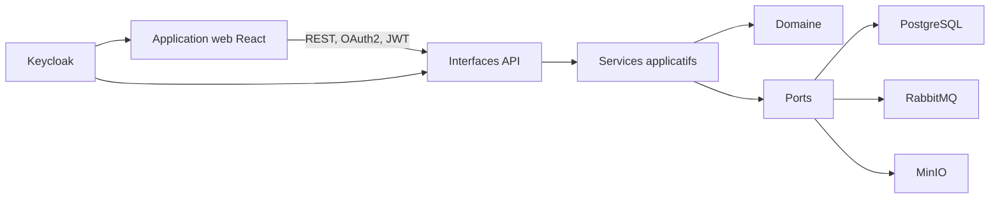
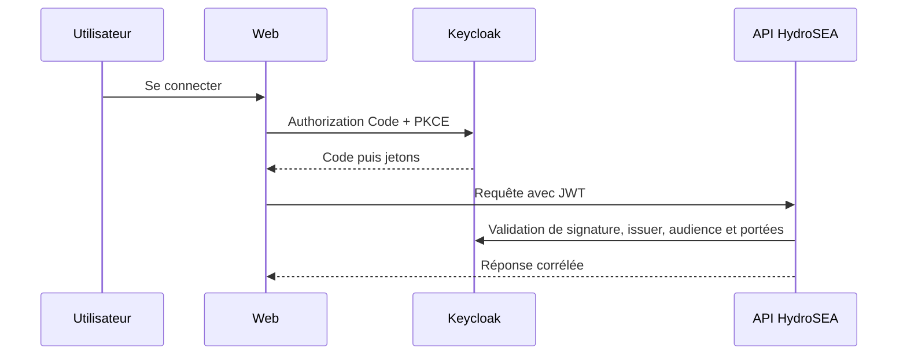

# Architecture applicative

HydroSEA est un monolithe modulaire. Les contrôleurs parlent aux Services applicatifs, qui orchestrent le domaine et des ports. Les adaptateurs techniques implémentent les ports.

Le domaine ne connaît aucun cadre technique. Une transaction Tiers modifie `ref`, écrit `evt.evenement_metier` et `evt.boite_envoi`. Le publieur différé est le seul composant qui contacte RabbitMQ. Le stockage documentaire est accessible par `PortStockageDocuments`, jamais par un module métier directement.

Le contrat OpenAPI fusionné dans `hydrosea-platform` au commit consigné dans `api/VERSION` est la source de vérité. `scripts/synchroniser-openapi.sh` accepte un chemin local ou une référence Git explicite et produit le miroir versionné `api/source`; celui-ci n’est jamais modifié à la main. Redocly produit `api/openapi.bundle.yaml`, puis le générateur produit le client TypeScript. La CI refuse toute différence entre le miroir épinglé, le regroupement et le client. Une rupture du contrat exige une mise à jour coordonnée et, si elle est incompatible, une nouvelle version d’API.

