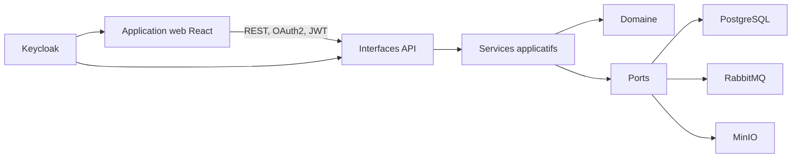
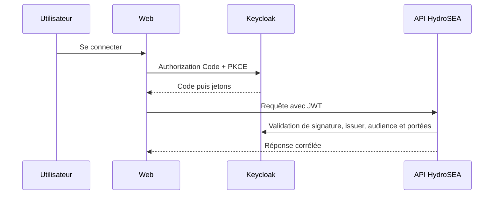

# Architecture applicative

HydroSEA est un monolithe modulaire. Les contrôleurs parlent aux Services applicatifs, qui orchestrent le domaine et des ports. Les adaptateurs techniques implémentent les ports.

Le domaine ne connaît aucun cadre technique. Une transaction Tiers modifie `ref`, écrit `evt.evenement_metier` et `evt.boite_envoi`. Le publieur différé est le seul composant qui contacte RabbitMQ. Le stockage documentaire est accessible par `PortStockageDocuments`, jamais par un module métier directement.

Les DTO HTTP sont mappés vers des commandes propres à la couche application. Le domaine ne dépend ni des DTO, ni des contrôleurs, ni des adaptateurs ; ces règles sont exécutables avec ArchUnit.

Pour une commande idempotente, l’application verrouille la portée `sujet OAuth2 + opération + URI complète + clé`, puis réserve l’état `EN_COURS` avant l’écriture métier. La réponse `TERMINE` conserve corps JSON, statut, `Location`, `ETag`, `X-Correlation-Id` et tout autre en-tête produit. Un rejeu renvoie strictement cet instantané sans relire la ressource ni réévaluer `If-Match`. Un traitement `ECHEC` peut être repris sous le même verrou et avec la même empreinte ; une empreinte différente produit `SYS-CLE-IDEMPOTENCE-CONFLIT`.

Un SIRET exact est bloquant (`TIE-DOUBLON-CERTAIN`) parmi les Tiers actifs et archivés, car cet identifiant légal reste unique et ne peut pas être réattribué. L’identité civile normalisée exacte et les homonymes de raison sociale ne recherchent que les Tiers actifs. L’identité civile exacte est bloquante ; une raison sociale seulement homonyme, notamment sans SIRET, est un signal non bloquant. Les codes stables du parcours sont `API-REQUETE-INVALIDE`, `TIE-ABSENT`, `TIE-DOUBLON-CERTAIN`, `SYS-CLE-IDEMPOTENCE-CONFLIT`, `SYS-VERSION-OBSOLETE`, `API-AUTORISATION` et `SYS-ERREUR-INTERNE`.

Le contrat OpenAPI fusionné dans `hydrosea-platform` au commit consigné dans `api/VERSION` est la source de vérité. `scripts/synchroniser-openapi.sh` accepte un chemin local ou une référence Git explicite et produit le miroir versionné `api/source`; celui-ci n’est jamais modifié à la main. Redocly produit `api/openapi.bundle.yaml`, puis le générateur produit le client TypeScript. La CI refuse toute différence entre le miroir épinglé, le regroupement et le client. Une rupture du contrat exige une mise à jour coordonnée et, si elle est incompatible, une nouvelle version d’API.

