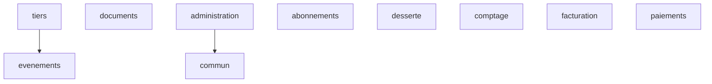

# Architecture modulaire

Les modules sont `commun`, `tiers`, `abonnements`, `desserte`, `comptage`, `facturation`, `paiements`, `documents`, `evenements` et `administration`. Seul `tiers` porte un parcours métier dans ce lot ; les autres frontières sont réservées sans comportement fictif.

Chaque module distingue `domaine`, `application`, `infrastructure` et `interfaceapi`. Le domaine contient les invariants. L’application orchestre les cas d’usage et publie par ports. L’infrastructure adapte PostgreSQL, RabbitMQ ou MinIO. L’interface traduit HTTP sans appeler de dépôt.

Règles : un module métier peut dépendre des interfaces publiques d’un autre, jamais de son infrastructure ni de ses tables privées. Les échanges synchrones utilisent des ports Java publics. Les échanges asynchrones utilisent des événements immuables. Les classes internes restent sous les sous-paquets du module. `commun` est limité à la corrélation, l’idempotence et les conventions API transverses ; un ajout hétérogène y est interdit.

ArchUnit vérifie l’indépendance du domaine, l’absence d’accès des contrôleurs aux adaptateurs et le placement des adaptateurs. Les revues de migration vérifient qu’un module ne lit pas les tables privées d’un autre. Le frontend dépend uniquement du contrat OpenAPI.

