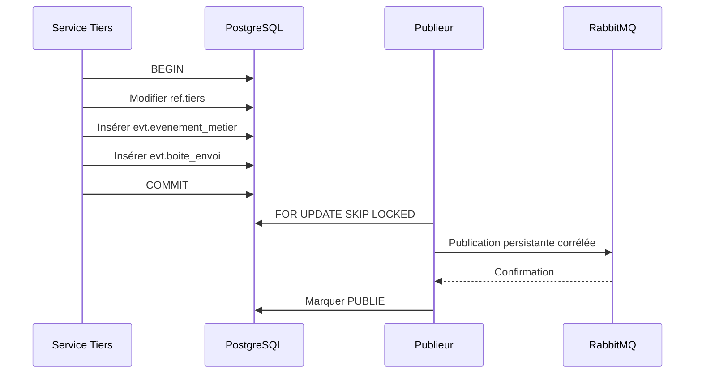

# Événements et boîte d’envoi

La création, la modification et l’archivage produisent respectivement `TIERS_CREE`, `TIERS_MODIFIE` et `TIERS_ARCHIVE`. La charge utile est minimale, sans coordonnées ni date de naissance. L’identifiant de corrélation est propagé.

Le publieur verrouille un lot sans bloquer ses pairs, incrémente les tentatives, diffère les reprises et classe en `ERREUR` après cinq échecs. Le `messageId` reprend l’identifiant de boîte d’envoi ; un destinataire futur doit le dédupliquer. Aucun consommateur métier n’est créé dans ce lot. Une file technique de test peut être déclarée uniquement sous le profil d’intégration.

Les tables et leurs colonnes suivent `evt.evenement_metier` et `evt.boite_envoi` publiées par le modèle logique. L’échange durable est `hydrosea.metier`, avec les clés `tiers.tiers_cree`, `tiers.tiers_modifie` et `tiers.tiers_archive`.

